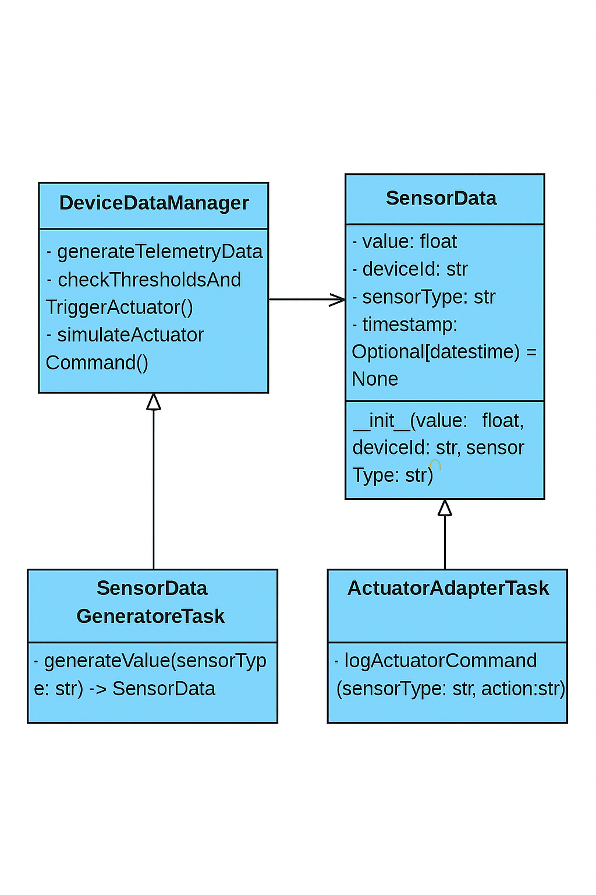

**Constrained Device Application (Connected Devices)**

Lab Module 03

Description

**What the Implementation does**

Lab Module 3 builds a smart IoT simulation that controls indoor climate automatically. It collects realistic sensor data for temperature, humidity, and pressure. If the temperature goes above 20°C or below 19°C, the system turns the HVAC on or off to keep things comfortable. The SensorDataGenerator creates 24-hour data sets with 1440 entries to mimic real sensor behavior, including random noise. The DeviceDataManager watches the temperature and sends commands to the HVAC system when needed. This setup shows how sensing, decision-making, and action work together in a smart building.

**How it works**

The system is built around DeviceDataManager, which controls three subsystems using callback functions. SensorAdapterManager uses APScheduler to collect data every 5 seconds from three simulated sensors: temperature, humidity, and pressure. These sensors use either time-series data or random values. If the temperature goes above 20°C or below 19°C, DeviceDataManager sends HVAC commands to ActuatorAdapterManager. This manager checks the location ID and forwards commands to the correct simulator (HVAC or humidifier), which logs realistic on/off actions. Duplicate commands are filtered to avoid unnecessary actuator changes. SystemPerformanceManager tracks CPU and memory every 60 seconds. The whole system runs through ConstrainedDeviceApp, ensuring smooth startup, shutdown, and error handling.

Code Repository and Branch
URL: https://github.com/emmapaq/cda-python-components/tree/labmodule03

**UML Design Diagram(s)**

UML diagram showing DeviceDataManager as central orchestrator implementing IDataMessageListener, coordinating SensorAdapterManager (with TemperatureSensorSimTask, HumiditySensorSimTask, PressureSensorSimTask using SensorDataGenerator), ActuatorAdapterManager (with HvacActuatorSimTask, HumidifierActuatorSimTask), and SystemPerformanceManager. All components use APScheduler for background task execution with callback-driven data flow and automatic threshold-based climate control logic.

**Unit Tests Executed**

1. test_ActuatorData
2. test_SensorData
3. test_SystemPerformanceData
4. test_TemperatureSensorSimTask
5. test_HumiditySensorSimTask
6. test_PressureSensorSimTask
7. test_HvacActuatorSimTask
8. test_HumidifierActuatorSimTask

**Integration Tests Executed**

1. test_SensorAdapterManager (60-second comprehensive sensor data generation)
2. test_ActuatorAdapterManager (actuator command processing with ON/OFF simulation)
3. test_DeviceDataManagerNoComms (120-second full system test with automatic HVAC control)
4. test_ConstrainedDeviceApp (complete application lifecycle with clean startup/shutdown)
