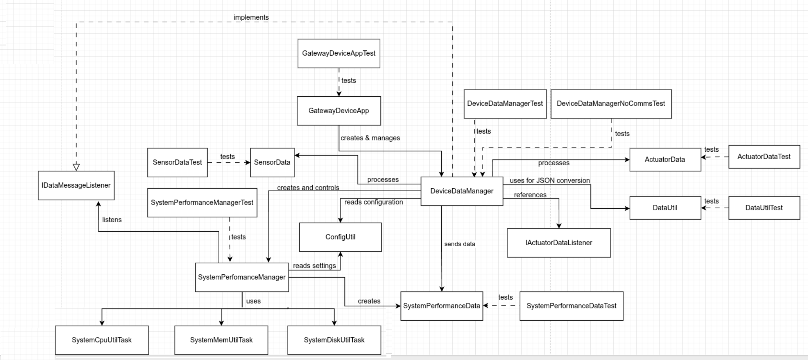

**Gateway Device Application (Connected Devices)**

## Lab Module 05 - Data Management

Description

**What the Implementation does**

Lab Module 5 builds a data manager for IoT gateway devices. The DeviceDataManager collects information from sensors, actuators, and system performance. It watches the computer's CPU, memory, and disk usage every 60 seconds and shows real numbers. The system can convert data to JSON format for sending to other devices. Everything connects through callback methods that pass data between components.

**How it works**

DeviceDataManager is the main controller that handles all data. It starts SystemPerformanceManager which runs a timer to check CPU, memory, and disk usage. When new performance data is ready, SystemPerformanceManager sends it to DeviceDataManager through callback methods. GatewayDeviceApp creates the DeviceDataManager and starts/stops it. DataUtil converts Java objects to JSON text and back. The system reads settings from a config file to turn features on or off.

Code Repository and Branch
URL: https://github.com/emmapaq/gda-java-components/tree/labmodule05

**UML Design Diagram(s)**

UML diagram indicates that GatewayDeviceApp creates DeviceDataManager, DeviceDataManager manages SystemPerformanceManager, and SystemPerformanceManager collects CPU/memory/disk data from system tasks.

**Unit Tests Executed**

- ActuatorDataTest
- SensorDataTest
- SystemPerformanceDataTest
- DataUtilTest

**Integration Tests Executed**

- SystemPerformanceManagerTest
- DataIntegrationTest
- DeviceDataManagerNoCommsTest
- GatewayDeviceAppTest
- RedisClientAdapterTest
- RedisClientAdapterTest
