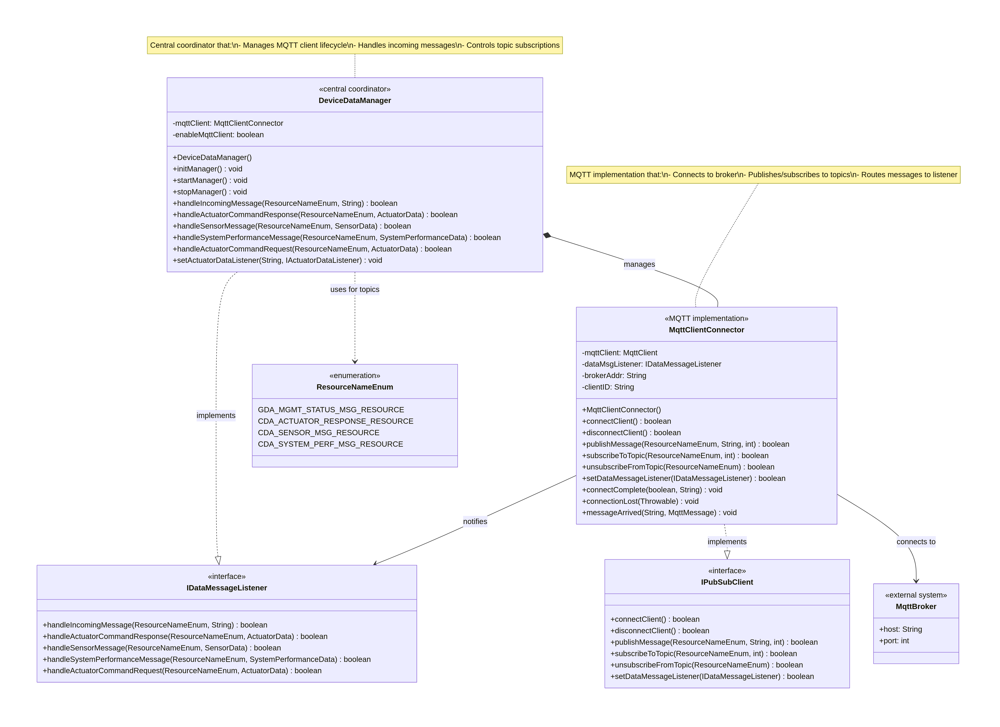

**Gateway Device Application (Connected Devices)**

## Lab Module 07

Description

**What the Implementation does**

The implementation of Lab Module 07 adds MQTT messaging capabilities to the Gateway Device Application so it can communicate with IoT devices and cloud services. I created four main exercises: implementing MQTT callback methods (connectComplete, connectionLost, deliveryComplete, messageArrived), integrating the MQTT client into DeviceDataManager's lifecycle, running integration tests with a live broker, and merging the completed work into the main branch. The system can now connect to MQTT brokers, subscribe to IoT topics, handle incoming sensor data, and send actuator commands.

**How it works**

The MqttClientConnector class uses the Eclipse Paho MQTT library to cater for all messaging operations. It implements the callback methods that respond automatically when connections succeed or fail, when messages are delivered, and when new messages arrive from subscribed topics. The DeviceDataManager integrates this MQTT client into its startup and shutdown processes, connecting to the broker and subscribing to four essential topics: GDA management status, CDA actuator responses, CDA sensor messages, and CDA system performance data. During testing, I ran the GDA application in one terminal while executing integration tests in my IDE to verify that messages flow correctly through a Mosquitto broker.

Code Repository and Branch URL: 
[https://github.com/emmapaq/gda-java-components/tree/labmodule07]

**UML Design Diagram(s)**

The design shows MqttClientConnector implementing IPubSubClient interface, integrated into DeviceDataManager alongside SystemPerformanceManager. DeviceDataManager acts as the central coordinator managing MQTT connectivity and implementing IDataMessageListener for message handling.

**Unit Tests Executed**

- MqttClientConnectorTest

**Integration Tests Executed**

- MqttClientConnectorTest
- gateway-device-app-0.0.1-jar-with-dependencies.jar
 
