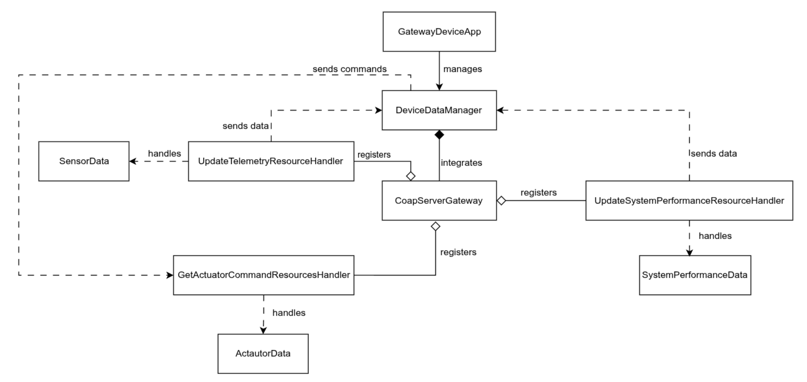

**Gateway Device Application (Connected Devices)**

## Lab Module 08

Description

**What the Implementation does**

To facilitate communication between the Gateway Device Application (GDA) and Constrained Devices (CDA) via a network, Lab Module 08 solution includes a CoAP server.  There are 3 endpoints created by the server, having the ability to; (i) transmit actuator orders, (ii) receive sensor data, and (iii) monitor system performance.  The Eclipse Californium library is used to manage communication using the CoAP protocol, a lightweight HTTP substitute made for IoT devices.  The server may respond to queries from CoAP clients and use the OBSERVE functionality to automatically alert them when actuator data changes.

**How it works**

The CoAP server is configured with three handlers: one for sensor data, one for performance data, and one for actuator instructions. DeviceDataManager creates a CoapServerGateway when the program launches.  The handler transforms data sent by a client in JSON format into a Java object before forwarding it to DeviceDataManager.  The actuator handler has the ability to automatically alert clients when new instructions are available.  Through path segmentation and folder creation when required, the server arranges resources in a tree structure similar to PIOT/ConstrainedDevice/SensorMsg.

Code Repository and Branch
URL: https://github.com/emmapaq/gda-java-components/tree/labmodule08

**UML Design Diagram(s)**

UML diagram showing relationships between: DeviceDataManager, CoapServerGateway
Three Resource Handlers: UpdateTelemetryResourceHandler (handles sensor data), UpdateSystemPerformanceResourceHandler (handles performance data), GetActuatorCommandResourceHandler (handles actuator commands, observable), SensorData, SystemPerformanceData, ActuatorData and Californium CoapServer (external library)

**Unit Tests Executed**

- N/A

**Integration Tests Executed**

- CoapServerGatewayTest 

