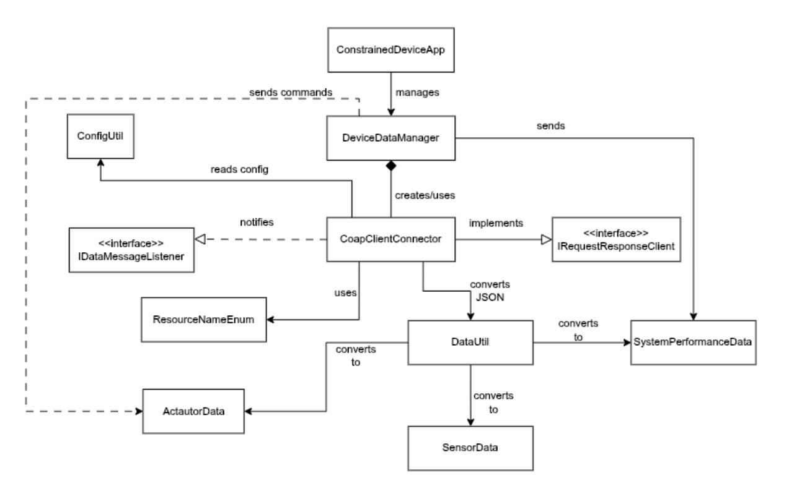

# Gateway Device Application (Connected Devices)

## Lab Module 09

**Description**

**What the Implementation does**

In Lab Module 09, CoapClientConnector was created to make it easier for a CoAP client and a server to communicate in an Internet of Things setting. In addition to providing functionality for a variety of CoAP request types, including GET, PUT, POST, DELETE, and device discovery, this class implements the IRequestResponse interface. Additionally, a GenericCoapResponseHandler class is built to handle responses, implementing the CoapHandler interface to process the server's responses.

**How it work?**

1. CoapClientConnector Class:

Here, the IRequestResponse interface, which offers a standardized method for handling requests and responses, is implemented by this class. Using a suitable CoAP library (such CoAPthon3 or aiocoap, as stated in the instructions) to interact with CoAP servers, the CoapClientConnector class will be in charge of starting and handling CoAP requests. The class will be modified to support multiple CoAP request types (GET, PUT, POST, and DELETE) and will incorporate network device discovery functions.

2. Discovery Functionality:

The CoapClientConnector was modified to provide discovery capability, which means it will be capable of discovering accessible CoAP resources or servers on the network. For Internet of Things applications, where servers or devices may dynamically join or exit the network, this is essential. The client can find available devices or services in the network by implementing device discovery via CoAP multicast or other CoAP-specific discovery protocols.

3. GET Requests:

The current method definitions in IRequestResponseHandler is used by the class to handle GET requests. Resources are retrieved from a CoAP server using a GET request. The CoapClientConnector will send a GET request using the selected CoAP library and manage the server's response. The response will be processed using the GenericCoapResponseHandler.

4. PUT Requests:

The CoAP server's current resources can be updated or modified via PUT requests. A PUT request will be sent to the server via the CoapClientConnector, which will then process the response using the IRequestResponseHandler interface. By adding new data to the server or changing an existing resource, the PUT technique will be put into practice.

5. POST Requests:

On a CoAP server, POST requests are used to submit data for processing or generate new resources. The CoapClientConnector will use the IRequestResponseHandler interface to manage the response after sending a POST request. This functionality is critical for cases where new data or configurations need to be uploaded to a CoAP server.

6. DELETE Requests:

To delete data or resources from the CoAP server, utilize DELETE requests. The CoapClientConnector class will submit a DELETE request to the server, utilizing the IRequestResponseHandler interface to handle the response. The DELETE request will guarantee that the data or resource is deleted from the server, and the response will be handled appropriately.

7. GenericCoapResponseHandler Class:

The GenericCoapResponseHandler implements the CoapHandler interface and is responsible for processing responses from the CoAP server.
The handler will define methods for processing different types of responses, such as success, error, or timeout.
This class will be used by the CoapClientConnector to handle the responses to GET, PUT, POST, DELETE, and discovery requests.

### Code Repository and Branch

NOTE: Be sure to include the branch (e.g. https://github.com/programming-the-iot/python-components/tree/alpha001).

URL: https://github.com/emmapaq/gda-java-components/tree/labmodule09

### UML Design Diagram(s)

### Unit Tests Executed

- CoapServerAdapterTest
- DeviceDataManagerTest
 

### Integration Tests Executed

- CoapClientConnectorTest

