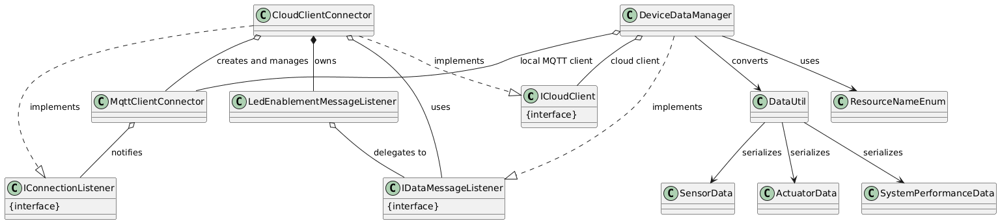

**Constrained Device Application (Connected Devices)**

Lab Module 11

Description

**What the Implementation does**

The GDA collects environmental sensor data (temperature, humidity, pressure) from the CDA on three separate MQTT topics and transmits it to Ubidots cloud service. It subscribes to Ubidots LED actuation events that trigger based on sensor threshold rules. When cloud commands arrive, the GDA processes them and forwards them back to the CDA for device actuation.

**How it works**

The CloudClientConnector manages secure TLS communication with Ubidots and provisions the LED topic on successful connection. The DeviceDataManager subscribes to three sensor-specific topics locally and routes sensor messages to the cloud via sendEdgeDataToCloud(). When Ubidots publishes an LED command, the LedEnablementMessageListener converts it to ActuatorData and forwards it to the CDA via local MQTT.

Code Repository and Branch
URL: https://github.com/emmapaq/cda-python-components/tree/labmodule11

**UML Design Diagram(s)**

The primary classes involved in Lab Module 11 implementation are CloudClientConnector, MqttClientConnector, LedEnablementMessageListener, and DeviceDataManager. Supporting interfaces include ICloudClient, IConnectionListener, and IDataMessageListener. Data model classes are SensorData, ActuatorData, and SystemPerformanceData. Utility classes are DataUtil and ResourceNameEnum.

**Unit Tests:**

TimeAndValuePayloadDataTest.java
DataUtilTest.java

**Integration Tests:**

CloudClientConnectorTest.java

