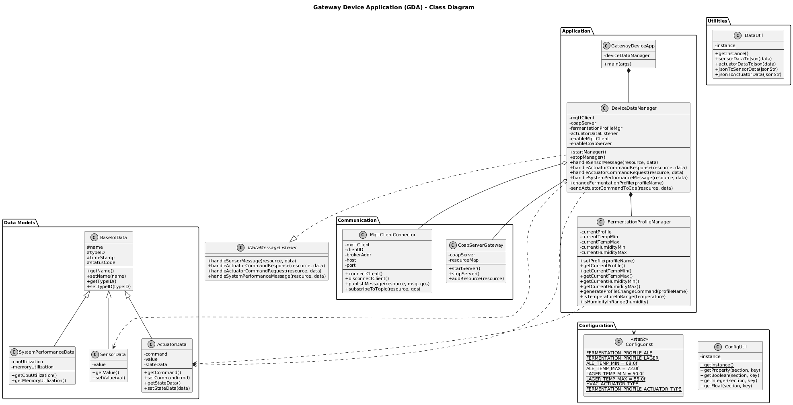

# Lab Module 12 - GDA Implementation

## Description

The Gateway Device Application (GDA) for the Smart Fermentation Chamber Controller serves as the intermediary between the edge device (CDA) and cloud services. The GDA aggregates sensor data from the CDA, manages fermentation profile configurations, persists time-series data to Redis, forwards telemetry to cloud MQTT broker, and relays actuation commands bidirectionally between cloud and CDA.

## What Does It Do?

The GDA performs the following functions:

1. **Data Aggregation**: Receives temperature, humidity, pressure, and system performance data from CDA via MQTT or CoAP.

2. **Fermentation Profile Management**: Maintains the current fermentation profile configuration and generates profile change commands to send to the CDA when users request profile switches.

3. **Data Persistence**: Stores time-series sensor data and actuation events to Redis database for historical analysis and fermentation progress tracking.

4. **Cloud Integration**: Forwards all sensor telemetry and system performance data to cloud MQTT broker for remote monitoring and dashboard visualization.

5. **Command Relay**: Receives actuation commands and profile changes from cloud interface and relays them to the CDA.

6. **Threshold Analysis**: Performs humidity threshold analysis for legacy humidifier control (from earlier modules).

## How Does It Work?

### Architecture

The GDA implements the IDataMessageListener interface to handle all incoming data from CDA and cloud sources:

**Data Reception Flow:**
1. CDA sends sensor data via MQTT (port 8883, TLS encrypted) or CoAP (port 5684, DTLS encrypted)
2. MqttClientConnector or CoapServerGateway receives the data
3. DeviceDataManager.handleSensorMessage() is invoked
4. Data is converted to JSON format
5. Data is stored to Redis (if persistence enabled)
6. Data is forwarded to cloud MQTT broker
7. Local data analysis is performed (humidity threshold checking)

**Command Processing Flow:**
1. Cloud dashboard sends actuation command (e.g., profile change to LAGER)
2. GDA receives command via MQTT subscription
3. DeviceDataManager.handleActuatorCommandResponse() is invoked
4. If profile change: FermentationProfileManager.setProfile() updates thresholds
5. FermentationProfileManager.generateProfileChangeCommand() creates ActuatorData
6. Command is sent to CDA via sendActuatorCommandToCda() using MQTT or CoAP
7. CDA acknowledges and applies new profile

### Key Implementation Details

**FermentationProfileManager:**
- Manages four profile types: ALE, LAGER, CONDITIONING, COLD_CRASH
- Stores temperature and humidity min/max for each profile
- Provides validation methods: isTemperatureInRange(), isHumidityInRange()
- Calculates optimal setpoints: getOptimalTemperature(), getOptimalHumidity()
- Generates ActuatorData commands for profile changes

## UML Class Diagram

**Gateway Device Application (GDA)**

